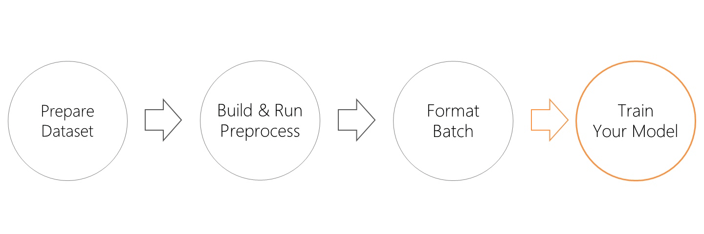

# chariot

[](https://badge.fury.io/py/chariot)
[](https://travis-ci.org/chakki-works/chariot)
[](https://codecov.io/gh/chakki-works/chariot)

**Deliver the ready-to-train data to your NLP model.**


* Prepare Dataset
  * You can prepare typical NLP datasets through the [chazutsu](https://github.com/chakki-works/chazutsu).
* Build & Run Preprocess
  * You can build the preprocess pipeline like [scikit-learn Pipeline](http://scikit-learn.org/stable/modules/generated/sklearn.pipeline.Pipeline.html).
  * Preprocesses for each dataset column are executed in parallel by [Joblib](https://pythonhosted.org/joblib/index.html).
  * Multi-language text tokenization is supported by [spaCy](https://spacy.io/).
* Format Batch
  * Sampling a batch from preprocessed dataset and format it to train the model (padding etc).
  * You can use pre-trained word vectors through the [chakin](https://github.com/chakki-works/chakin).

**chariot** enables you to concentrate on training your model!



## Install

```
pip install chariot
```

## Prepare dataset

You can download various dataset by using [chazutsu](https://github.com/chakki-works/chazutsu).  

```py
import chazutsu
from chariot.storage import Storage


storage = Storage("your/data/root")
r = chazutsu.datasets.MovieReview.polarity().download(storage.path("raw"))

df = storage.chazutsu(r.root).data()
df.head(5)
```

Then

```
	polarity	review
0	0	synopsis : an aging master art thief , his sup...
1	0	plot : a separated , glamorous , hollywood cou...
2	0	a friend invites you to a movie . this film wo...
```

`Storage` class manage the directory structure that follows [cookie-cutter datascience](https://drivendata.github.io/cookiecutter-data-science/).

```
Project root
  └── data
       ├── external     <- Data from third party sources (ex. word vectors).
       ├── interim      <- Intermediate data that has been transformed.
       ├── processed    <- The final, canonical datasets for modeling.
       └── raw          <- The original, immutable data dump.
```

## Build & Run Preprocess

### Build a preprocess pipeline

All preprocessors are defined at `chariot.transformer`.  
Transformers are implemented by extending [scikit-learn `Transformer`](https://scikit-learn.org/stable/modules/generated/sklearn.base.TransformerMixin.html).  
Because of this, the API of Transformer is familiar to you. And you can mix [scikit-learn's preprocessors](https://scikit-learn.org/stable/modules/preprocessing.html).

```py
import chariot.transformer as ct
from chariot.preprocessor import Preprocessor


preprocessor = Preprocessor()
preprocessor\
    .stack(ct.text.UnicodeNormalizer())\
    .stack(ct.Tokenizer("en"))\
    .stack(ct.token.StopwordFilter("en"))\
    .stack(ct.Vocabulary(min_df=5, max_df=0.5))\
    .fit(train_data)

preprocessor.save("my_preprocessor.pkl")

loaded = Preprocessor.load("my_preprocessor.pkl")
```

There is 6 type of transformers are prepared in chariot.

* TextPreprocessor
  * Preprocess the text before tokenization.
  * `TextNormalizer`: Normalize text (replace some character etc).
  * `TextFilter`: Filter the text (delete some span in text stc).
* Tokenizer
  * Tokenize the texts.
  * It powered by [spaCy](https://spacy.io/) and you can choose [MeCab](https://github.com/taku910/mecab) or [Janome](https://github.com/mocobeta/janome) for Japanese.
* TokenPreprocessor
  * Normalize/Filter the tokens after tokenization.
  * `TokenNormalizer`: Normalize tokens (to lower, to original form etc).
  * `TokenFilter`: Filter tokens (extract only noun etc).
* Vocabulary
  * Make vocabulary and convert tokens to indices.
* Formatter
  * Format (preprocessed) data for training your model.
* Generator
  * Genrate target data to train your (language) model.

### Build a preprocess for dataset

When you want to make preprocess to each of your dataset column, you can use `DatasetPreprocessor`.

```py
from chariot.dataset_preprocessor import DatasetPreprocessor
from chariot.transformer.formatter import Padding


dp = DatasetPreprocessor()
dp.process("review")\
    .by(ct.text.UnicodeNormalizer())\
    .by(ct.Tokenizer("en"))\
    .by(ct.token.StopwordFilter("en"))\
    .by(ct.Vocabulary(min_df=5, max_df=0.5))\
    .by(Padding(length=pad_length))\
    .fit(train_data["review"])
dp.process("polarity")\
    .by(ct.formatter.CategoricalLabel(num_class=3))


preprocessed = dp.preprocess(data)

# DatasetPreprocessor has multiple preprocessor.
# Because of this, save file format is `tar.gz`.
dp.save("my_dataset_preprocessor.tar.gz")

loaded = DatasetPreprocessor.load("my_dataset_preprocessor.tar.gz")
```

## Train your model with chariot

`chariot` has feature to traing your model.

```py
formatted = dp(train_data).preprocess().format().processed

model.fit(formatted["review"], formatted["polarity"], batch_size=32,
          validation_split=0.2, epochs=15, verbose=2)

```

```py
for batch in dp(train_data.preprocess().iterate(batch_size=32, epoch=10):
    model.train_on_batch(batch["review"], batch["polarity"])

```

You can use pre-trained word vectors by [chakin](https://github.com/chakki-works/chakin).  


```py
from chariot.storage import Storage
from chariot.transformer.vocabulary import Vocabulary

# Download word vector
storage = Storage("your/data/root")
storage.chakin(name="GloVe.6B.50d")

# Make embedding matrix
vocab = Vocabulary()
vocab.set(["you", "loaded", "word", "vector", "now"])
embed = vocab.make_embedding(storage.path("external/glove.6B.50d.txt"))
print(embed.shape)  # (len(vocab.count), 50)
```
